# fcc-oop-visualization
Understanding "Object Oriented Programming" of freeCodeCamp's "JavaScript Algorithms and Data Structures" better with visualization.

## [Create a Basic JavaScript Object](https://www.freecodecamp.org/learn/javascript-algorithms-and-data-structures/object-oriented-programming/create-a-basic-javascript-object)

Objects in JavaScript are used to model real-world objects, giving  them properties and behavior just like their real-world counterparts.  Here's an example using these concepts to create a `duck` object:

```js
let duck = {
  name: "Aflac",
  numLegs: 2
};
```

This `duck` object has two property/value pairs: a `name` of `Aflac` and a `numLegs` of 2.

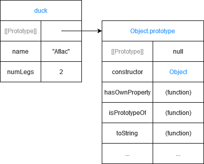

## [Create a Method on an Object](https://www.freecodecamp.org/learn/javascript-algorithms-and-data-structures/object-oriented-programming/create-a-method-on-an-object)

Objects can have a special type of property, called a *method*.

Methods are properties that are functions. This adds different behavior to an object. Here is the `duck` example with a method:

```js
let duck = {
  name: "Aflac",
  numLegs: 2,
  sayName: function() {return "The name of this duck is " + duck.name + ".";}
};
duck.sayName();
```

The example adds the `sayName` method, which is a function that returns a sentence giving the name of the `duck`.

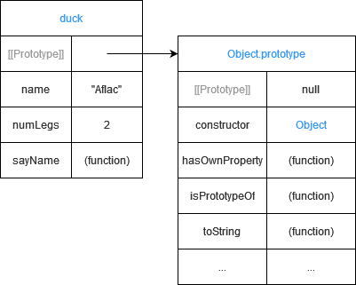

## [Define a Constructor Function](https://www.freecodecamp.org/learn/javascript-algorithms-and-data-structures/object-oriented-programming/define-a-constructor-function)

*Constructors* are functions that create new objects. They  define properties and behaviors that will belong to the new object.  Think of them as a blueprint for the creation of new objects.

Here is an example of a constructor:

```js
function Bird() {
  this.name = "Albert";
  this.color = "blue";
  this.numLegs = 2;
}
```

This constructor defines a `Bird` object with properties `name`, `color`, and `numLegs` set to Albert, blue, and 2, respectively. Constructors follow a few conventions:

- Constructors are defined with a capitalized name to distinguish them from other functions that are not `constructors`.
- Constructors use the keyword `this` to set properties of the object they will create. Inside the constructor, `this` refers to the new object it will create.
- Constructors define properties and behaviors instead of returning a value as other functions might.

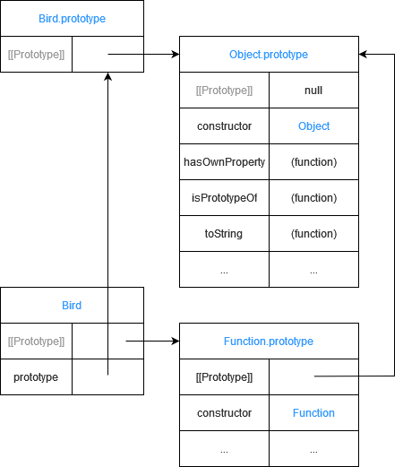

## [Use a Constructor to Create Objects](https://www.freecodecamp.org/learn/javascript-algorithms-and-data-structures/object-oriented-programming/use-a-constructor-to-create-objects)

Here's the `Bird` constructor from the previous challenge:

```js
function Bird() {
  this.name = "Albert";
  this.color  = "blue";
  this.numLegs = 2;
}

let blueBird = new Bird();
```

**NOTE:** `this` inside the constructor always refers to the object being created.

Notice that the `new` operator is used when calling a constructor. This tells JavaScript to create a new instance of `Bird` called `blueBird`. Without the `new` operator, `this` inside the constructor would not point to the newly created object, giving unexpected results. Now `blueBird` has all the properties defined inside the `Bird` constructor:

```js
blueBird.name;
blueBird.color;
blueBird.numLegs;
```

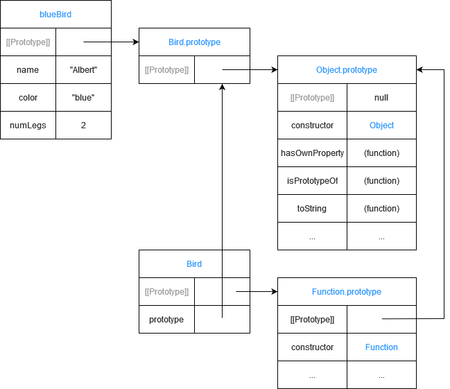

## [Verify an Object's Constructor with instanceof](https://www.freecodecamp.org/learn/javascript-algorithms-and-data-structures/object-oriented-programming/verify-an-objects-constructor-with-instanceof)

Anytime a constructor function creates a new object, that object is said to be an instance of its constructor. JavaScript gives a convenient way to verify this with the `instanceof` operator. `instanceof` allows you to compare an object to a constructor, returning `true` or `false` based on whether or not that object was created with the constructor. Here's an example:

```js
let Bird = function(name, color) {
  this.name = name;
  this.color = color;
  this.numLegs = 2;
}

let crow = new Bird("Alexis", "black");

crow instanceof Bird;
```

This `instanceof` method would return `true`.

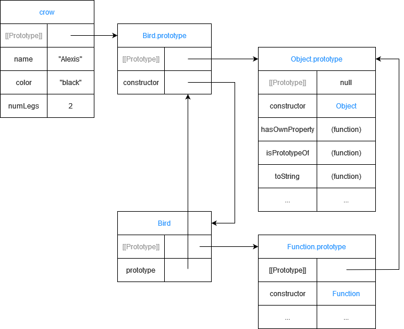

## [Use Prototype Properties to Reduce Duplicate Code](https://www.freecodecamp.org/learn/javascript-algorithms-and-data-structures/object-oriented-programming/use-prototype-properties-to-reduce-duplicate-code)

Since `numLegs` will probably have the same value for all instances of `Bird`, you essentially have a duplicated variable `numLegs` inside each `Bird` instance.

This may not be an issue when there are only two instances, but  imagine if there are millions of instances. That would be a lot of  duplicated variables.

A better way is to use the `prototype` of `Bird`. Properties in the `prototype` are shared among ALL instances of `Bird`. Here's how to add `numLegs` to the `Bird prototype`:

```js
Bird.prototype.numLegs = 2;
```

Now all instances of `Bird` have the `numLegs` property.

```js
console.log(duck.numLegs);
console.log(canary.numLegs);
```

Since all instances automatically have the properties on the `prototype`, think of a `prototype` as a "recipe" for creating objects. Note that the `prototype` for `duck` and `canary` is part of the `Bird` constructor as `Bird.prototype`. Nearly every object in JavaScript has a `prototype` property which is part of the constructor function that created it.

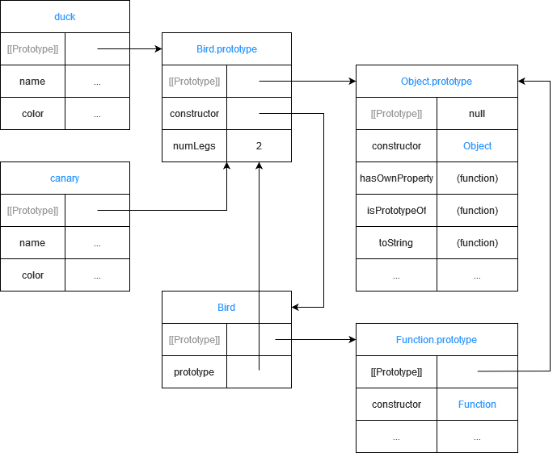

## [Iterate Over All Properties](https://www.freecodecamp.org/learn/javascript-algorithms-and-data-structures/object-oriented-programming/iterate-over-all-properties)

You have now seen two kinds of properties: own properties and `prototype` properties. Own properties are defined directly on the object instance itself. And prototype properties are defined on the `prototype`.

```js
function Bird(name) {
  this.name = name;  //own property
}

Bird.prototype.numLegs = 2; // prototype property

let duck = new Bird("Donald");
```

Here is how you add `duck`'s own properties to the array `ownProps` and `prototype` properties to the array `prototypeProps`:

```js
let ownProps = [];
let prototypeProps = [];

for (let property in duck) {
  if(duck.hasOwnProperty(property)) {
    ownProps.push(property);
  } else {
    prototypeProps.push(property);
  }
}

console.log(ownProps);
console.log(prototypeProps);
```

`console.log(ownProps)` would display `["name"]` in the console, and `console.log(prototypeProps)` would display `["numLegs"]`.

------

Add all of the own properties of `beagle` to the array `ownProps`. Add all of the `prototype` properties of `Dog` to the array `prototypeProps`.

---

```js
function Dog(name) {
  this.name = name;
}

Dog.prototype.numLegs = 4;

let beagle = new Dog("Snoopy");

let ownProps = [];
let prototypeProps = [];

for (let property in beagle) {
  if (beagle.hasOwnProperty(property)) {
    ownProps.push(property);
  } else {
    prototypeProps.push(property);
  }
}
```

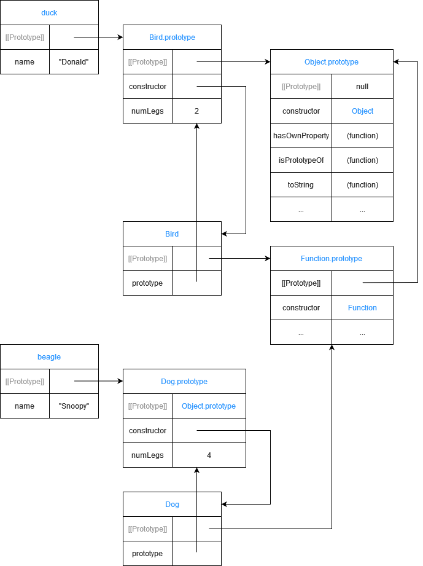

## [Understand the Constructor Property](https://www.freecodecamp.org/learn/javascript-algorithms-and-data-structures/object-oriented-programming/understand-the-constructor-property)

There is a special `constructor` property located on the object instances `duck` and `beagle` that were created in the previous challenges:

```js
let duck = new Bird();
let beagle = new Dog();

console.log(duck.constructor === Bird); 
console.log(beagle.constructor === Dog);
```

Both of these `console.log` calls would display `true` in the console.

## [Change the Prototype to a New Object](https://www.freecodecamp.org/learn/javascript-algorithms-and-data-structures/object-oriented-programming/change-the-prototype-to-a-new-object)

Up until now you have been adding properties to the `prototype` individually:

```js
Bird.prototype.numLegs = 2;
```

This becomes tedious after more than a few properties.

```js
Bird.prototype.eat = function() {
  console.log("nom nom nom");
}

Bird.prototype.describe = function() {
  console.log("My name is " + this.name);
}
```

A more efficient way is to set the `prototype` to a new object that already contains the properties. This way, the properties are added all at once:

```js
Bird.prototype = {
  numLegs: 2, 
  eat: function() {
    console.log("nom nom nom");
  },
  describe: function() {
    console.log("My name is " + this.name);
  }
};
```

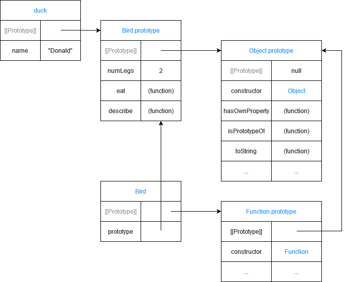

## [Remember to Set the Constructor Property when Changing the Prototype](https://www.freecodecamp.org/learn/javascript-algorithms-and-data-structures/object-oriented-programming/remember-to-set-the-constructor-property-when-changing-the-prototype)

There is one crucial side effect of manually setting the prototype to a new object. It erases the `constructor` property! This property can be used to check which constructor function created the instance, but since the property has been overwritten, it  now gives false results:

```js
duck.constructor === Bird;
duck.constructor === Object;
duck instanceof Bird;
```

In order, these expressions would evaluate to `false`, `true`, and `true`.

To fix this, whenever a prototype is manually set to a new object, remember to define the `constructor` property:

```js
Bird.prototype = {
  constructor: Bird,
  numLegs: 2,
  eat: function() {
    console.log("nom nom nom");
  },
  describe: function() {
    console.log("My name is " + this.name); 
  }
};
```

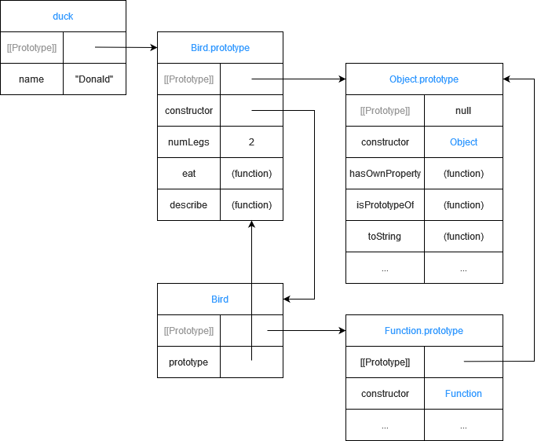

## [Understand the Prototype Chain](https://www.freecodecamp.org/learn/javascript-algorithms-and-data-structures/object-oriented-programming/understand-the-prototype-chain)

All objects in JavaScript (with a few exceptions) have a `prototype`. Also, an object’s `prototype` itself is an object.

```js
function Bird(name) {
  this.name = name;
}

typeof Bird.prototype;
```

Because a `prototype` is an object, a `prototype` can have its own `prototype`! In this case, the `prototype` of `Bird.prototype` is `Object.prototype`:

```js
Object.prototype.isPrototypeOf(Bird.prototype);
```

How is this useful? You may recall the `hasOwnProperty` method from a previous challenge:

```js
let duck = new Bird("Donald");
duck.hasOwnProperty("name");
```

The `hasOwnProperty` method is defined in `Object.prototype`, which can be accessed by `Bird.prototype`, which can then be accessed by `duck`. This is an example of the `prototype` chain. In this `prototype` chain, `Bird` is the `supertype` for `duck`, while `duck` is the `subtype`. `Object` is a `supertype` for both `Bird` and `duck`. `Object` is a `supertype` for all objects in JavaScript. Therefore, any object can use the `hasOwnProperty` method.


## [Use Inheritance So You Don't Repeat Yourself](https://www.freecodecamp.org/learn/javascript-algorithms-and-data-structures/object-oriented-programming/use-inheritance-so-you-dont-repeat-yourself)

There's a principle in programming called *Don't Repeat Yourself (DRY)*. The reason repeated code is a problem is because any change requires  fixing code in multiple places. This usually means more work for  programmers and more room for errors.

Notice in the example below that the `describe` method is shared by `Bird` and `Dog`:

```js
Bird.prototype = {
  constructor: Bird,
  describe: function() {
    console.log("My name is " + this.name);
  }
};

Dog.prototype = {
  constructor: Dog,
  describe: function() {
    console.log("My name is " + this.name);
  }
};
```

The `describe` method is repeated in two places. The code can be edited to follow the DRY principle by creating a `supertype` (or parent) called `Animal`:

```js
function Animal() { };

Animal.prototype = {
  constructor: Animal, 
  describe: function() {
    console.log("My name is " + this.name);
  }
};
```

Since `Animal` includes the `describe` method, you can remove it from `Bird` and `Dog`:

```js
Bird.prototype = {
  constructor: Bird
};

Dog.prototype = {
  constructor: Dog
};
```

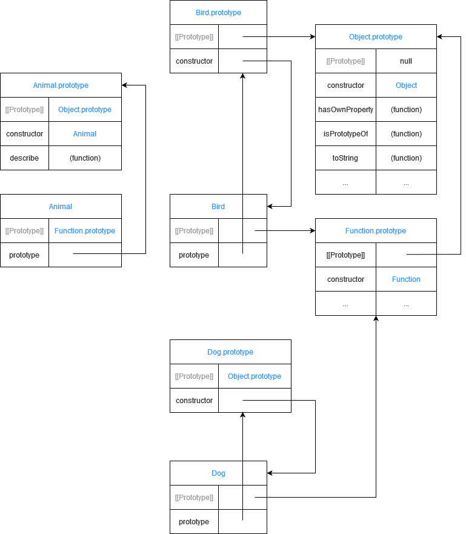

## [Inherit Behaviors from a Supertype](https://www.freecodecamp.org/learn/javascript-algorithms-and-data-structures/object-oriented-programming/inherit-behaviors-from-a-supertype)

In the previous challenge, you created a `supertype` called `Animal` that defined behaviors shared by all animals:

```js
function Animal() { }
Animal.prototype.eat = function() {
  console.log("nom nom nom");
};
```

This and the next challenge will cover how to reuse the methods of `Animal` inside `Bird` and `Dog` without defining them again. It uses a technique called inheritance.  This challenge covers the first step: make an instance of the `supertype` (or parent). You already know one way to create an instance of `Animal` using the `new` operator:

```js
let animal = new Animal();
```

There are some disadvantages when using this syntax for inheritance,  which are too complex for the scope of this challenge. Instead, here's  an alternative approach without those disadvantages:

```js
let animal = Object.create(Animal.prototype);
```

`Object.create(obj)` creates a new object, and sets `obj` as the new object's `prototype`. Recall that the `prototype` is like the "recipe" for creating an object. By setting the `prototype` of `animal` to be the `prototype` of `Animal`, you are effectively giving the `animal` instance the same "recipe" as any other instance of `Animal`.

```js
animal.eat();
animal instanceof Animal;
```

The `instanceof` method here would return `true`.

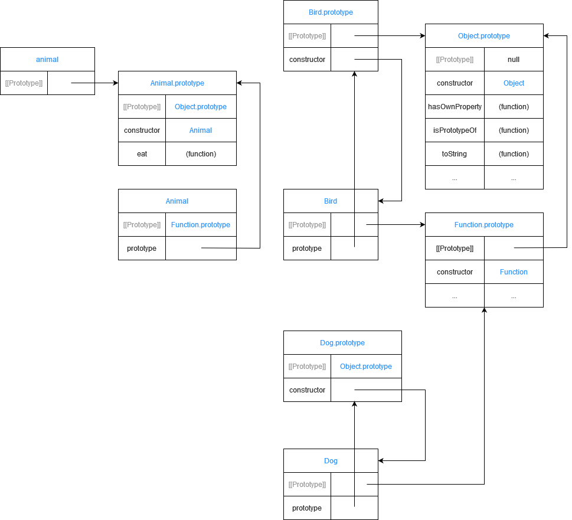

## [Set the Child's Prototype to an Instance of the Parent](https://www.freecodecamp.org/learn/javascript-algorithms-and-data-structures/object-oriented-programming/set-the-childs-prototype-to-an-instance-of-the-parent)

In the previous challenge you saw the first step for inheriting behavior from the supertype (or parent) `Animal`: making a new instance of `Animal`.

This challenge covers the next step: set the `prototype` of the subtype (or child)—in this case, `Bird`—to be an instance of `Animal`.

```js
Bird.prototype = Object.create(Animal.prototype);
```

Remember that the `prototype` is like the "recipe" for creating an object. In a way, the recipe for `Bird` now includes all the key "ingredients" from `Animal`.

```js
let duck = new Bird("Donald");
duck.eat();
```

`duck` inherits all of `Animal`'s properties, including the `eat` method.

------

Modify the code so that instances of `Dog` inherit from `Animal`.

------

```js
function Animal() { }

Animal.prototype = {
  constructor: Animal,
  eat: function () {
    console.log("nom nom nom");
  }
};

function Dog() { }

Dog.prototype = Object.create(Animal.prototype)

let beagle = new Dog();
```

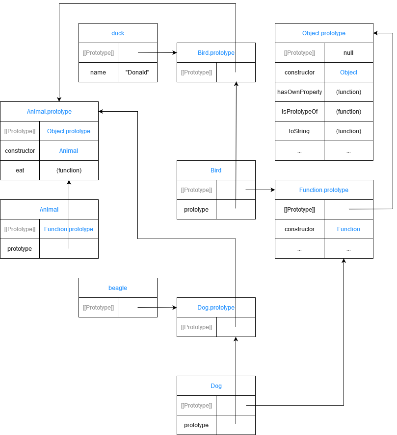

## [Reset an Inherited Constructor Property](https://www.freecodecamp.org/learn/javascript-algorithms-and-data-structures/object-oriented-programming/reset-an-inherited-constructor-property)

When an object inherits its `prototype` from another object, it also inherits the supertype's constructor property.

Here's an example:

```js
function Bird() { }
Bird.prototype = Object.create(Animal.prototype);
let duck = new Bird();
duck.constructor
```

But `duck` and all instances of `Bird` should show that they were constructed by `Bird` and not `Animal`. To do so, you can manually set the constructor property of `Bird` to the `Bird` object:

```js
Bird.prototype.constructor = Bird;
duck.constructor
```

------

Fix the code so `duck.constructor` and `beagle.constructor` return their respective constructors.

---

```js
function Animal() { }
function Bird() { }
function Dog() { }

Bird.prototype = Object.create(Animal.prototype)
Dog.prototype = Object.create(Animal.prototype)

Bird.prototype.constructor = Bird
Dog.prototype.constructor = Dog

let duck = new Bird()
let beagle = new Dog()
```

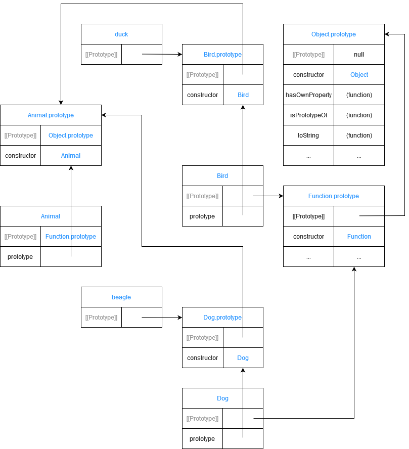

## [Add Methods After Inheritance](https://www.freecodecamp.org/learn/javascript-algorithms-and-data-structures/object-oriented-programming/add-methods-after-inheritance)

A constructor function that inherits its `prototype` object from a supertype constructor function can still have its own methods in addition to inherited methods.

For example, `Bird` is a constructor that inherits its `prototype` from `Animal`:

```js
function Animal() { }
Animal.prototype.eat = function() {
  console.log("nom nom nom");
};
function Bird() { }
Bird.prototype = Object.create(Animal.prototype);
Bird.prototype.constructor = Bird;
```

In addition to what is inherited from `Animal`, you want to add behavior that is unique to `Bird` objects. Here, `Bird` will get a `fly()` function. Functions are added to `Bird's` `prototype` the same way as any constructor function:

```js
Bird.prototype.fly = function() {
  console.log("I'm flying!");
};
```

Now instances of `Bird` will have both `eat()` and `fly()` methods:

```js
let duck = new Bird();
duck.eat();
duck.fly();
```

`duck.eat()` would display the string `nom nom nom` in the console, and `duck.fly()` would display the string `I'm flying!`.


## [Override Inherited Methods](https://www.freecodecamp.org/learn/javascript-algorithms-and-data-structures/object-oriented-programming/override-inherited-methods)

In previous lessons, you learned that an object can inherit its behavior (methods) from another object by referencing its `prototype` object:

```js
ChildObject.prototype = Object.create(ParentObject.prototype);
```

Then the `ChildObject` received its own methods by chaining them onto its `prototype`:

```js
ChildObject.prototype.methodName = function() {...};
```

It's possible to override an inherited method. It's done the same way - by adding a method to `ChildObject.prototype` using the same method name as the one to override. Here's an example of `Bird` overriding the `eat()` method inherited from `Animal`:

```js
function Animal() { }
Animal.prototype.eat = function() {
  return "nom nom nom";
};
function Bird() { }

Bird.prototype = Object.create(Animal.prototype);

Bird.prototype.eat = function() {
  return "peck peck peck";
};
```

If you have an instance `let duck = new Bird();` and you call `duck.eat()`, this is how JavaScript looks for the method on the `prototype` chain of `duck`:

1. `duck` => Is `eat()` defined here? No.
2. `Bird` => Is `eat()` defined here? => Yes. Execute it and stop searching.
3. `Animal` => `eat()` is also defined, but JavaScript stopped searching before reaching this level.
4. Object => JavaScript stopped searching before reaching this level.

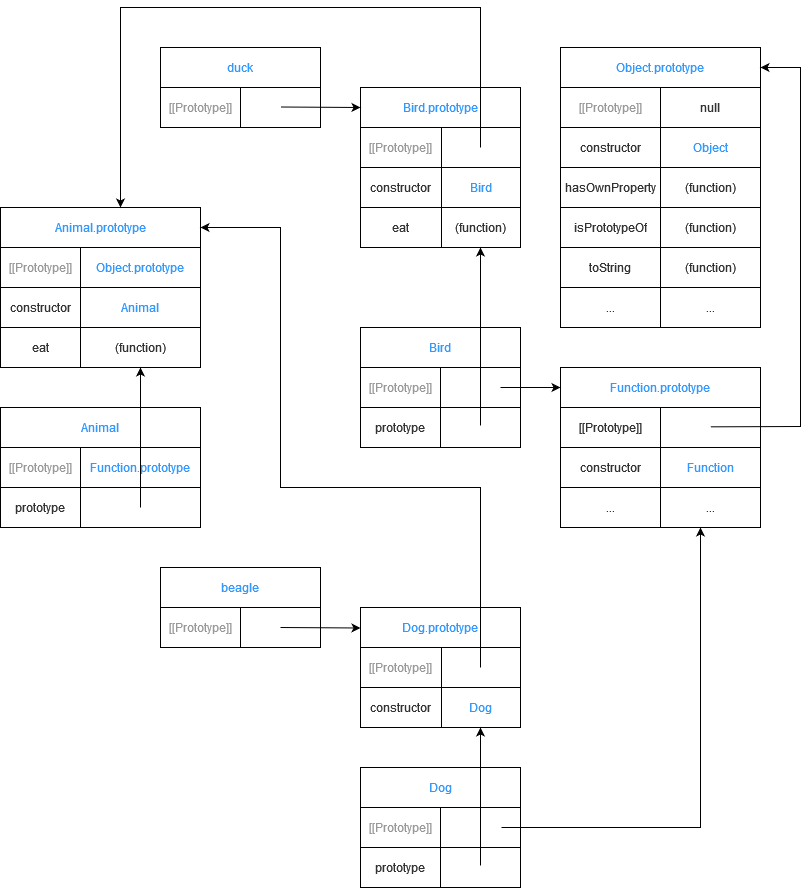

## [Use a Mixin to Add Common Behavior Between Unrelated Objects](https://www.freecodecamp.org/learn/javascript-algorithms-and-data-structures/object-oriented-programming/use-a-mixin-to-add-common-behavior-between-unrelated-objects)

As you have seen, behavior is shared through inheritance. However,  there are cases when inheritance is not the best solution. Inheritance  does not work well for unrelated objects like `Bird` and `Airplane`. They can both fly, but a `Bird` is not a type of `Airplane` and vice versa.

For unrelated objects, it's better to use *mixins*. A mixin allows other objects to use a collection of functions.

```js
let flyMixin = function(obj) {
  obj.fly = function() {
    console.log("Flying, wooosh!");
  }
};
```

The `flyMixin` takes any object and gives it the `fly` method.

```js
let bird = {
  name: "Donald",
  numLegs: 2
};

let plane = {
  model: "777",
  numPassengers: 524
};

flyMixin(bird);
flyMixin(plane);
```

Here `bird` and `plane` are passed into `flyMixin`, which then assigns the `fly` function to each object. Now `bird` and `plane` can both fly:

```js
bird.fly();
plane.fly();
```

The console would display the string `Flying, wooosh!` twice, once for each `.fly()` call.

Note how the mixin allows for the same `fly` method to be reused by unrelated objects `bird` and `plane`.

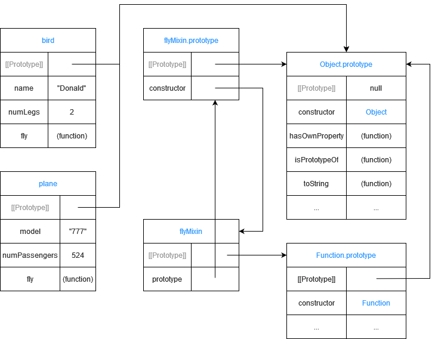

## [Use Closure to Protect Properties Within an Object from Being Modified Externally](https://www.freecodecamp.org/learn/javascript-algorithms-and-data-structures/object-oriented-programming/use-closure-to-protect-properties-within-an-object-from-being-modified-externally)

In the previous challenge, `bird` had a public property `name`. It is considered public because it can be accessed and changed outside of `bird`'s definition.

```js
bird.name = "Duffy";
```

Therefore, any part of your code can easily change the name of `bird` to any value. Think about things like passwords and bank accounts being easily changeable by any part of your codebase. That could cause a lot  of issues.

The simplest way to make this public property private is by creating a variable within the constructor function. This changes the scope of  that variable to be within the constructor function versus available  globally. This way, the variable can only be accessed and changed by  methods also within the constructor function.

```js
function Bird() {
  let hatchedEgg = 10;

  this.getHatchedEggCount = function() { 
    return hatchedEgg;
  };
}
let ducky = new Bird();
ducky.getHatchedEggCount();
```

Here `getHatchedEggCount` is a privileged method, because it has access to the private variable `hatchedEgg`. This is possible because `hatchedEgg` is declared in the same context as `getHatchedEggCount`. In JavaScript, a function always has access to the context in which it was created. This is called `closure`.

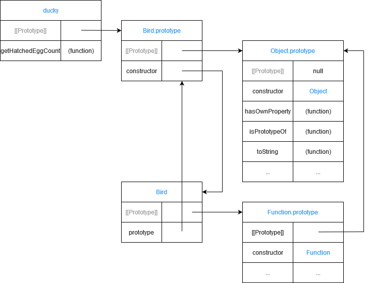

## [Use an IIFE to Create a Module](https://www.freecodecamp.org/learn/javascript-algorithms-and-data-structures/object-oriented-programming/use-an-iife-to-create-a-module)

An immediately invoked function expression (IIFE) is often used to group related functionality into a single object or module. For example, an earlier challenge defined two mixins:

```js
function glideMixin(obj) {
  obj.glide = function() {
    console.log("Gliding on the water");
  };
}
function flyMixin(obj) {
  obj.fly = function() {
    console.log("Flying, wooosh!");
  };
}
```

We can group these mixins into a module as follows:

```js
let motionModule = (function () {
  return {
    glideMixin: function(obj) {
      obj.glide = function() {
        console.log("Gliding on the water");
      };
    },
    flyMixin: function(obj) {
      obj.fly = function() {
        console.log("Flying, wooosh!");
      };
    }
  }
})();
```

Note that you have an immediately invoked function expression (IIFE) that returns an object `motionModule`. This returned object contains all of the mixin behaviors as properties  of the object. The advantage of the module pattern is that all of the  motion behaviors can be packaged into a single object that can then be  used by other parts of your code. Here is an example using it:

```js
motionModule.glideMixin(duck);
duck.glide();
```

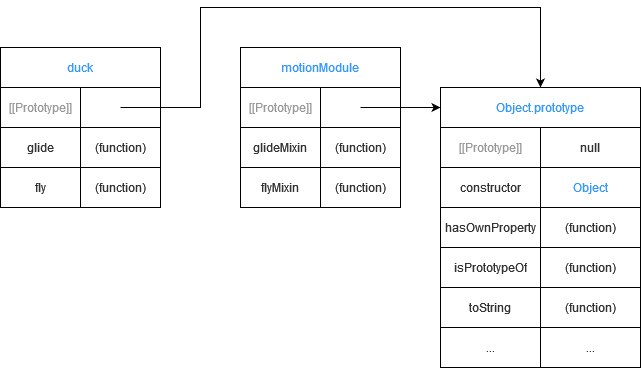

